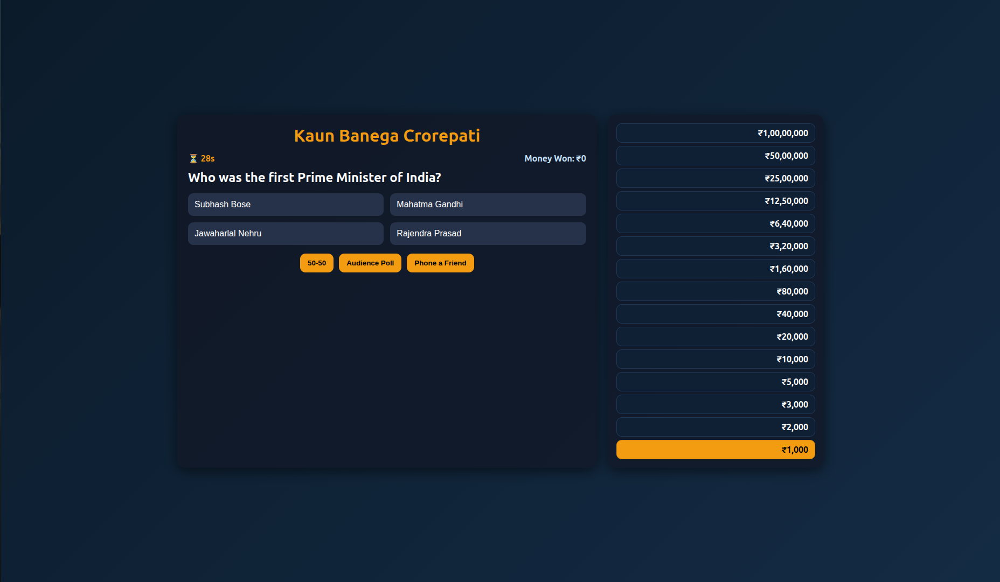
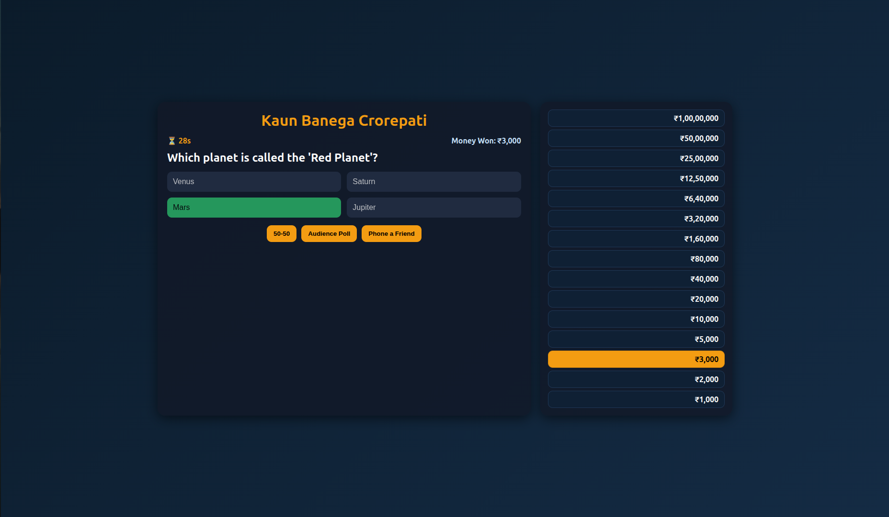
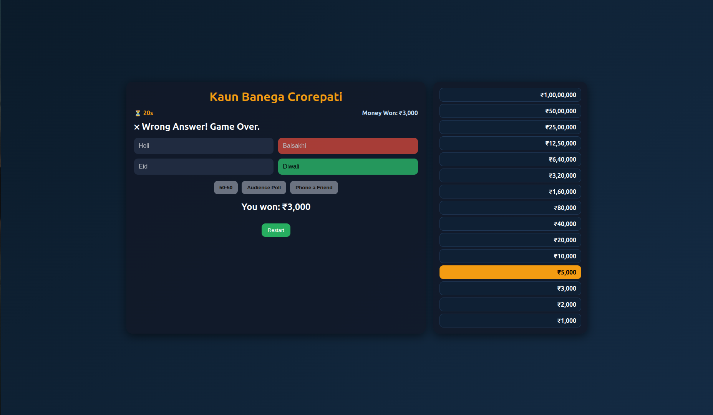
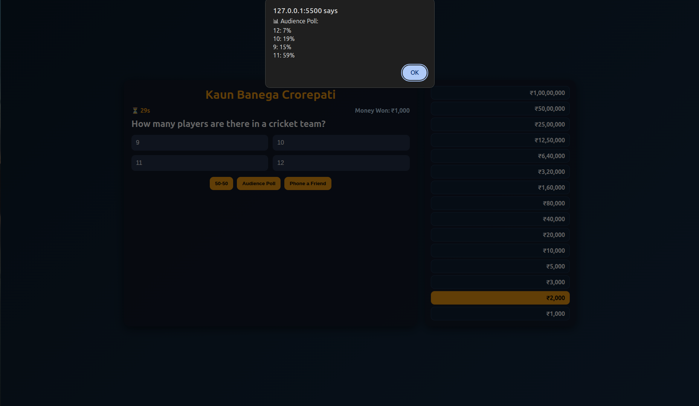
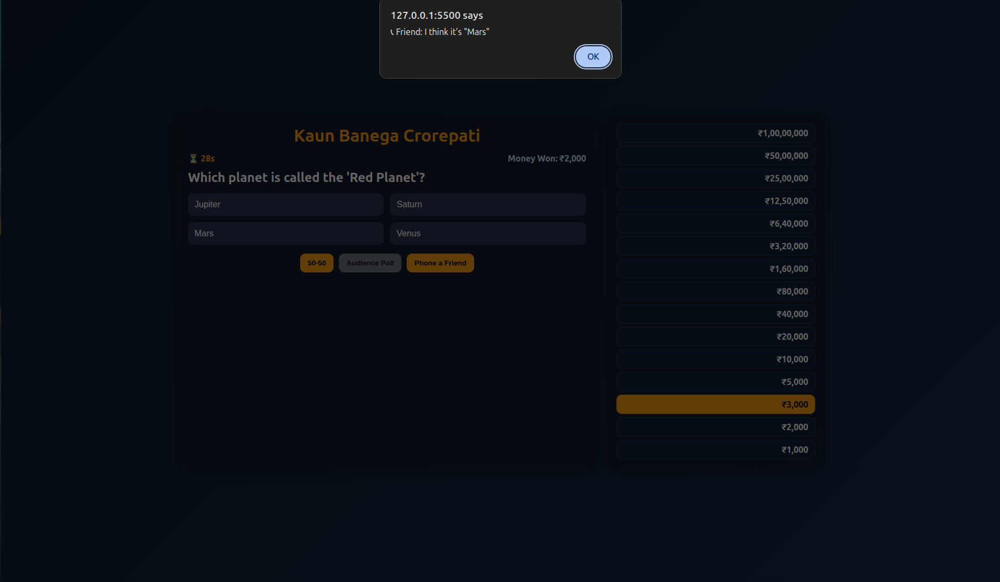
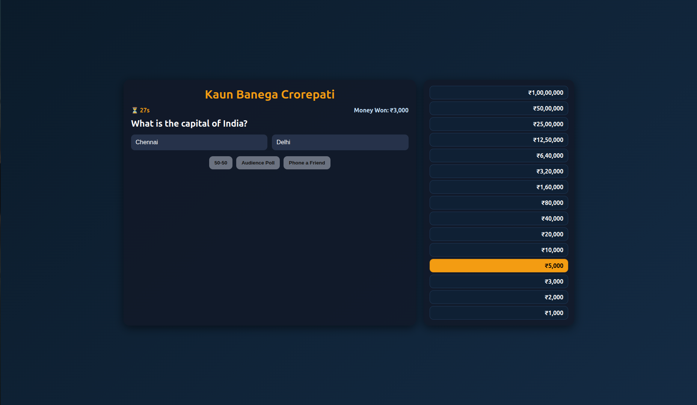

# Kaun Banega Crorepati (KBC) Quiz Game

A web-based quiz game inspired by the popular TV show **Kaun Banega Crorepati (KBC)**.
Test your knowledge, climb the money pyramid, use lifelines wisely, and see if you can become a **Crorepati**!

---

## Live Demo

[Live Demo](https://shahpranshu27.github.io/js-learn/kbc-quiz/)

## Features

* **15 Questions** of increasing difficulty (Easy → Medium → Hard).
* **Money Pyramid** (bottom-up like real KBC):

  * Starts from ₹1,000 and goes up to ₹1 Crore.
* **Timer Rules**:

  * **30 seconds** for first 5 questions (up to ₹10,000).
  * **60 seconds** for next 5 questions (₹20,000 – ₹1,60,000).
  * **No time limit** for the last 5 questions (₹3,20,000 – ₹1 Crore).
* **Lifelines** (just like KBC):

  * **50-50** → Removes 2 wrong answers.
  * **Audience Poll** → Shows percentage distribution from a virtual audience.
  * **Phone a Friend** → Your friend gives a suggestion (80% chance correct).
* **Automatic progression** to the next question after answering correctly.
* **Game Over** on wrong answer or timeout.
* **Restart button** to play again with a new random set of questions.

---

## Screenshots

1. UI

2. Correct Answer

3. Wrong Answer

4. Audient Poll

5. Phone A Fiend

6. 50-50

---

## How to Play

1. Open the game in your browser (`index.html`).
2. The game starts with **₹1,000 question**.
3. Select the correct answer to move up the prize ladder.
4. Use **lifelines** when you’re stuck:

   * **50-50** removes two wrong options.
   * **Audience Poll** shows poll percentages.
   * **Phone a Friend** gives a suggestion.
5. Beat the timer ⏳ and aim for **₹1 Crore!**

---

## Question Bank

* Divided into 3 levels:

  * **Easy (1k – 10k)** → General knowledge basics.
  * **Medium (20k – 1.6L)** → Tougher GK, history, geography, culture.
  * **Hard (3.2L – 1Cr)** → Advanced GK, science, politics, world events.
* Questions are **randomized** each play.

---

## Tech Stack

* **HTML5** – Layout
* **CSS3** – Styling
* **JavaScript (Vanilla JS)** – Game logic & interactivity

---

## Future Improvements

* Add **sound effects** (background music, right/wrong answer sounds).
* Better **audience poll UI** (bar chart instead of alert).
* Responsive mobile-friendly design.
* Expand **question bank** with more real KBC-level questions.
