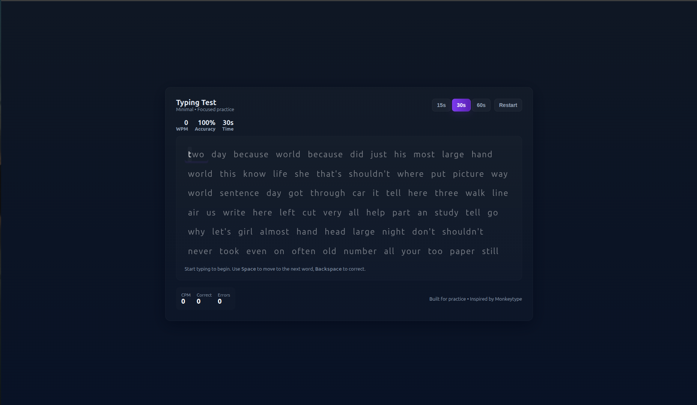
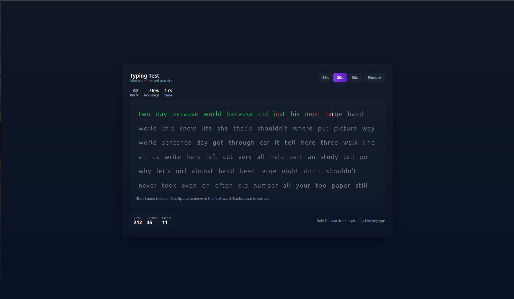
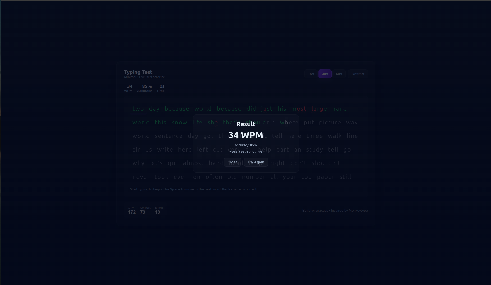

# Typing Speed Test

A clean and minimal typing speed test application inspired by [Monkeytype](https://monkeytype.com/).  
This app helps users practice typing, improve speed, and track accuracy in real-time.

---

## Demo

[Live Demo]()

---

## Features

- **Multiple Time Modes** – Choose from `15s`, `30s`, or `60s`.
- **Dynamic Word Flow** – Only 6–7 lines of text are visible at a time. As you type, old text moves up and new text flows in from the bottom.
- **Real-Time Typing Feedback**:
  - Correct characters turn **white**.
  - Incorrect characters turn **red**.
- **Statistics Dashboard** – At the end of each test, see:
  - **Words Per Minute (WPM)**
  - **Accuracy (%)**
  - **Characters Typed (correct vs incorrect)**
- **Modern UI** – Built with **TailwindCSS** for a responsive, clean, and attractive interface.
- **Keyboard Friendly** – No mouse interaction needed once test starts.
- **Lightweight & Fast** – No external dependencies beyond Tailwind.

---

## 🖼️ Screenshots

1. UI



2. Live Tracking



3. Results



---

## Tech Stack

- **HTML5**
- **CSS3 (TailwindCSS)**
- **JavaScript (Vanilla)**

---

## How to Run Locally

1. Clone the repository:
   ```bash
   git clone https://github.com/shahpranshu27/js-learn/typing-speed-test.git

2. Navigate into the folder:

   ```bash
   cd typing-speed-test
   ```

3. Open `index.html` in your browser.

---

## Future Improvements

* Dark/Light theme toggle
* High score tracking using **LocalStorage**
* Add difficulty levels (easy, medium, hard word sets)
* Multiplayer typing race mode